# Vue Firebase

## Screenshot 
1. **Tampilan Awal**
- 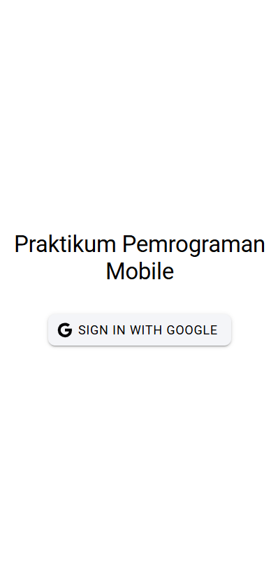
2. **Pilih Email**
- 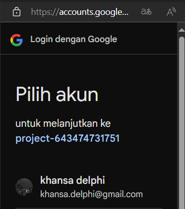
3. **Masuk**
- 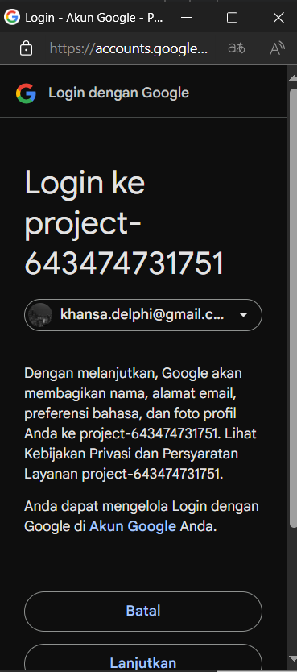
4. **Home (Updated)**
- 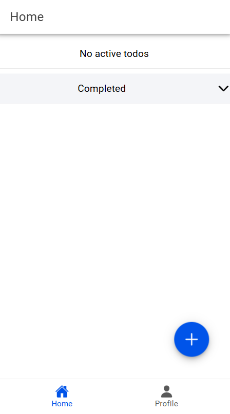
5. **Profile**
- 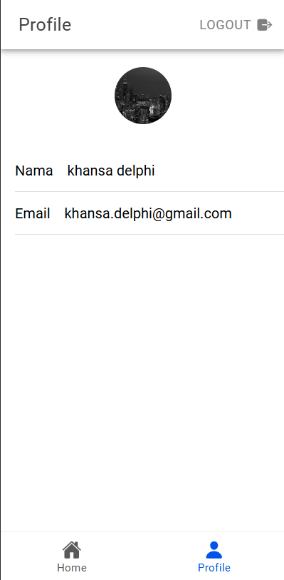

## Penjelasan
1. **Konfigurasi Firebase**
- Proyek dihubungkan dengan Firebase melalui file firebase.ts di dalam folder utils. File ini berisi konfigurasi Firebase dengan kunci API, domain otentikasi, ID proyek, dll.
- Untuk autentikasi, digunakan GoogleAuthProvider dari Firebase untuk mengautentikasi pengguna melalui akun Google.
2. **Proses Autentikasi Login**
- Fungsi loginWithGoogle menginisialisasi GoogleAuth dengan clientId serta meminta akses ke profil dan email pengguna.
- Pengguna kemudian masuk menggunakan Google, dan idToken yang diperoleh dari login Google digunakan untuk membuat kredensial dengan GoogleAuthProvider.credential(idToken).
- Kredensial ini digunakan untuk masuk ke Firebase Authentication menggunakan signInWithCredential(). Setelah autentikasi berhasil, objek pengguna (result.user) diperoleh dan disimpan dalam state (user.value).
3. **Menampilkan Data Profil Pengguna**
- Informasi pengguna seperti displayName (nama tampilan) dan email diambil dari objek user yang disimpan. Foto profil (photoURL) juga dapat diakses dari properti user.
- Halaman profil menampilkan data ini menggunakan ion-input yang diisi dengan data pengguna, dan elemen gambar (ion-avatar) menampilkan foto profil pengguna.
4. **Navigasi dan Pengamanan Rute**
- Sebelum mengakses rute tertentu seperti /home dan /profile, status autentikasi pengguna diperiksa. Jika pengguna belum login, mereka diarahkan ke halaman login.
- Jika pengguna sudah login dan mencoba mengakses halaman login, mereka akan diarahkan ke halaman beranda (/home).

## Penjelasan Todo 
1. **Create**
- 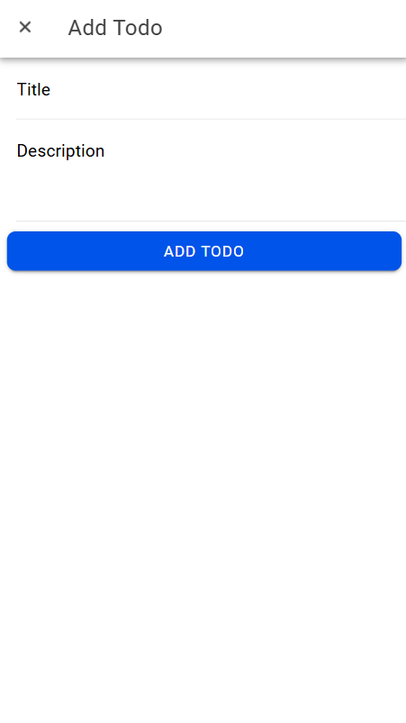 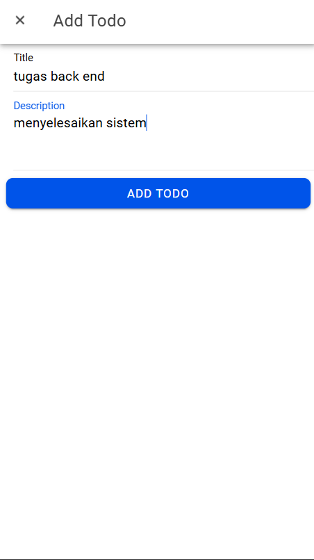 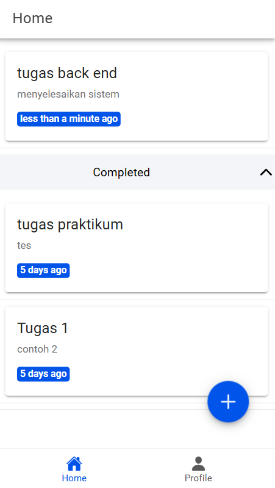
- Data todo baru ditambahkan melalui form di komponen InputModal.vue. Ketika pengguna menekan tombol Add Todo, fungsi input() dipanggil dan memancarkan event submit dengan data todo.
```
<ion-button type="button" @click="input" shape="round" color="primary" expand="block">
  {{ editingId ? 'Edit' : 'Add' }} Todo
</ion-button>
```
```
async addTodo(todo: Omit<Todo, 'id'>) {
    const todoRef = this.getTodoRef();
    const docRef = await addDoc(todoRef, {
        ...todo,
        status: false,
        createdAt: Timestamp.now(),
        updatedAt: Timestamp.now(),
    });
    return docRef.id;
}
```
- Modal menerima input title dan description. Data dikirim ke fungsi addTodo untuk disimpan ke Firestore dengan properti tambahan status (default: false), createdAt, dan updatedAt.
2. **Read**
- 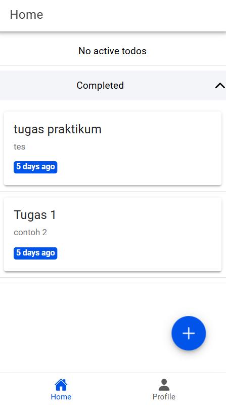
- Todos diambil dari database Firestore dan ditampilkan di halaman HomePage.vue.
```
async getTodos(): Promise<Todo[]> {
    const todoRef = this.getTodoRef();
    const q = query(todoRef, orderBy('updatedAt', 'desc'));
    const snapshot = await getDocs(q);
    return snapshot.docs.map((doc) => ({
        id: doc.id,
        ...doc.data()
    } as Todo));
}
```
```
onMounted(() => {
    loadTodos();
});

const loadTodos = async () => {
    todos.value = await firestoreService.getTodos();
};
```
- Fungsi getTodos mengambil data todo dari Firestore. Data disusun berdasarkan updatedAt secara menurun. Data di-render ke komponen dengan pembagian ke active todos (status: false) dan completed todos (status: true).
3. **Update**
- 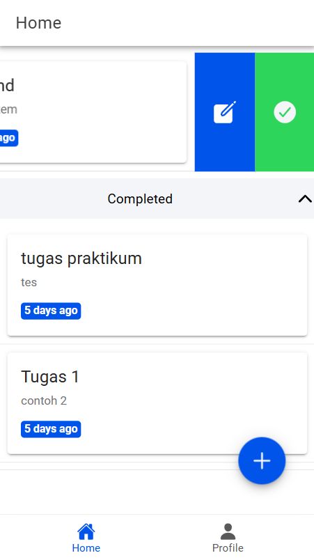 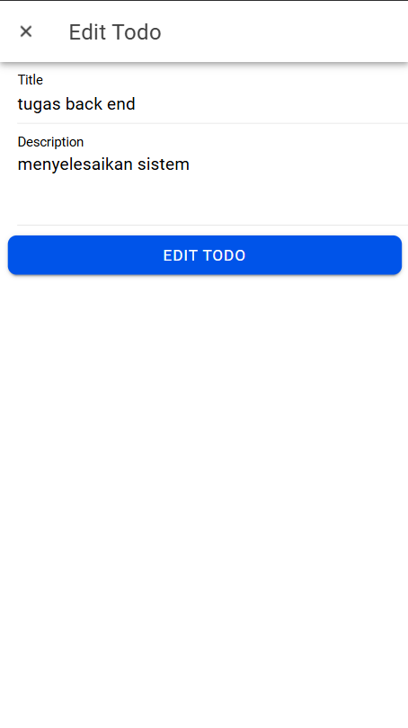  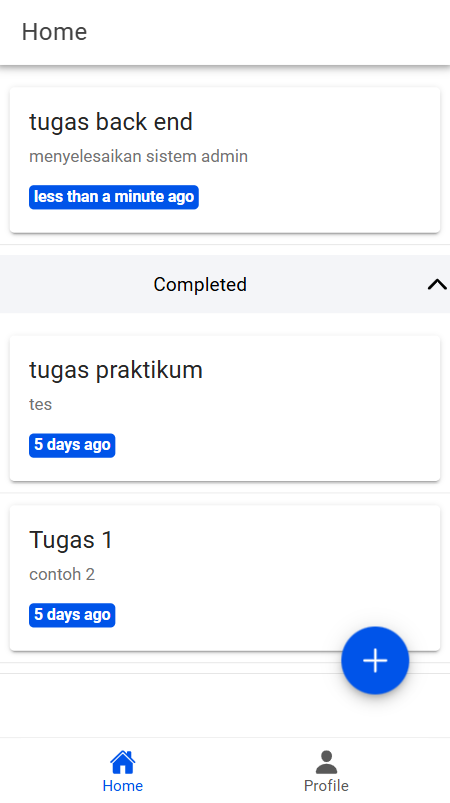
- Pengguna memilih todo untuk diedit. Setelah pengeditan, tombol Edit Todo mengeksekusi fungsi handleSubmit untuk memperbarui data di Firestore.
```
const input = () => {
    emit('submit', props.todo);
    cancel();
};
```
```
async updateTodo(id: string, todo: Partial<Todo>) {
    const todoRef = this.getTodoRef();
    const docRef = doc(todoRef, id);
    await updateDoc(docRef, {
        ...todo,
        updatedAt: Timestamp.now(),
    });
}
```
- Todo yang diedit dipilih melalui event handleEdit. Setelah pengeditan, fungsi updateTodo memodifikasi data di Firestore, termasuk memperbarui updatedAt.
4. **Delete**
- 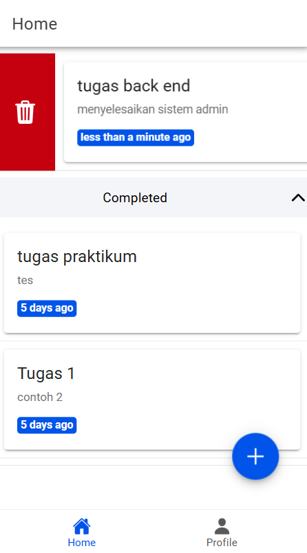 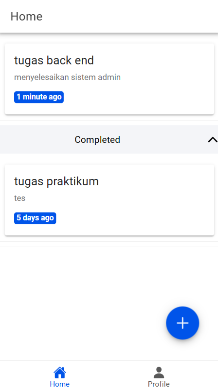
- Todo dapat dihapus melalui tombol atau geser (swipe) ke kiri. Fungsi handleDelete memanggil deleteTodo.
```
const handleDelete = async (deleteTodo: Todo) => {
    await firestoreService.deleteTodo(deleteTodo.id!);
    loadTodos();
};
```
```
async deleteTodo(id: string) {
    const todoRef = this.getTodoRef();
    const docRef = doc(todoRef, id);
    await deleteDoc(docRef);
}
```
- Todo yang dipilih dihapus berdasarkan ID-nya. Setelah penghapusan, daftar todos dimuat ulang dengan loadTodos.
5. **Update Status Todo**
- 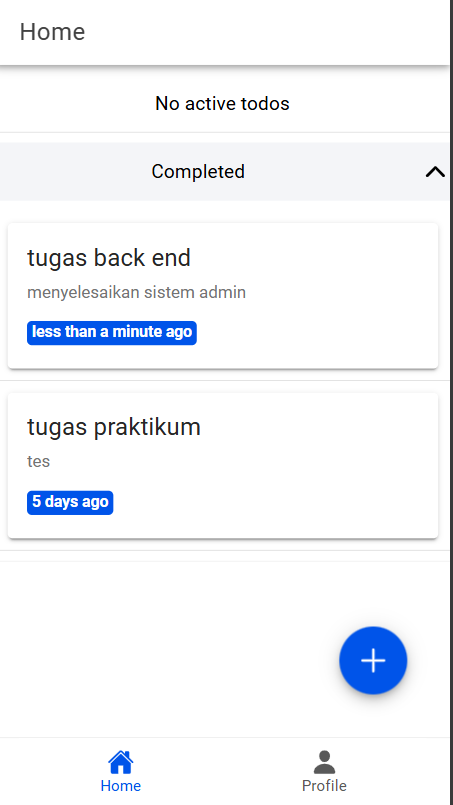
- Status todo diubah dengan mengetuk tombol atau geser (swipe) ke kanan. Fungsi updateStatus mengubah properti status di Firestore.
```
const handleStatus = async (statusTodo: Todo) => {
    await firestoreService.updateStatus(statusTodo.id!, !statusTodo.status);
    loadTodos();
};
```
```
async updateStatus(id: string, status: boolean) {
    const todoRef = this.getTodoRef();
    const docRef = doc(todoRef, id);
    await updateDoc(docRef, { status: status, updatedAt: Timestamp.now() });
}
```
- Status todo diubah menjadi completed (true) atau active (false). Perubahan status tercatat di Firestore dengan pembaruan timestamp.